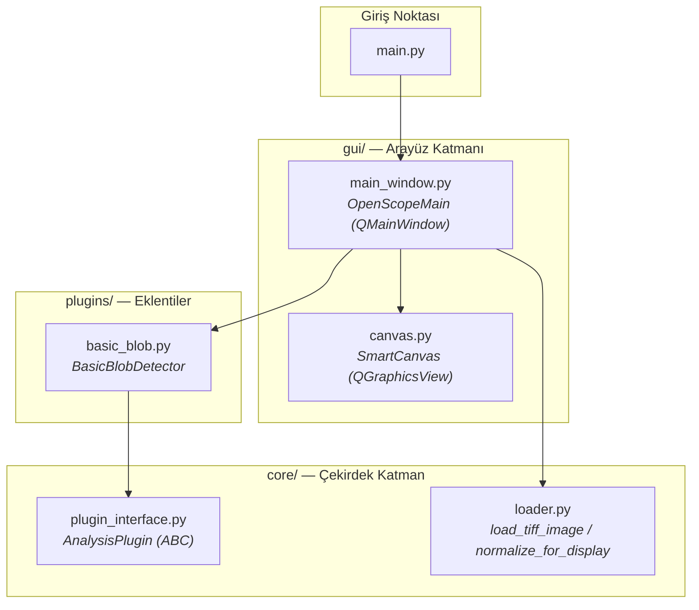

# OpenScope – Proje Özet Raporu

> **Tarih:** 10 Şubat 2026  
> **Toplam Kaynak Kodu:** ~460 satır Python (8 dosya)  
> **Teknoloji Yığını:** Python · PyQt6 · OpenCV · NumPy · tifffile

---

## 1. Proje Nedir?

**OpenScope**, bilimsel görüntü analizi için geliştirilen masaüstü bir uygulamadır. TIFF formatındaki mikroskop görüntülerini açıp, üzerlerinde otomatik analiz algoritmaları çalıştırmayı hedefler. Temel kullanım senaryosu, bakteri gibi koyu nesnelerin açık arka plandan otomatik olarak tespit edilmesidir.

Uygulama **plugin mimarisi** üzerine kurulmuştur — yeni analiz algoritmaları kolayca eklenebilecek şekilde tasarlanmıştır.

---

## 2. Mimari Yapı

| Klasör | Dosya | Satır | Açıklama |
|--------|-------|------:|----------|
| `/` | [main.py](file:///home/fatih/Dev/OpenScope/main.py) | 20 | Uygulama giriş noktası, QApplication başlatır |
| `core/` | [plugin_interface.py](file:///home/fatih/Dev/OpenScope/core/plugin_interface.py) | 37 | Tüm pluginlerin uyması gereken soyut sınıf (`AnalysisPlugin`) |
| `core/` | [loader.py](file:///home/fatih/Dev/OpenScope/core/loader.py) | 39 | TIFF dosya yükleyici ve 8-bit normalizasyon fonksiyonları |
| `gui/` | [main_window.py](file:///home/fatih/Dev/OpenScope/gui/main_window.py) | 202 | Ana pencere: sidebar, menü, analiz çalıştırma, sonuç overlay |
| `gui/` | [canvas.py](file:///home/fatih/Dev/OpenScope/gui/canvas.py) | 95 | Akıllı görüntü tuval: zoom, pan, numpy→QPixmap dönüşümü |
| `plugins/` | [basic_blob.py](file:///home/fatih/Dev/OpenScope/plugins/basic_blob.py) | 67 | Temel blob (leke) tespiti algoritması |

---

## 3. Yapılan Geliştirmeler (Detaylı)

### 3.1 🏗️ Proje İskeleti ve Ortam Kurulumu
- Python proje yapısı oluşturuldu (`core/`, `gui/`, `plugins/`, `data/`, `assets/`)
- Her paketin `__init__.py` dosyası eklendi
- `requirements.txt` ile bağımlılıklar tanımlandı:
  - `PyQt6 6.10.2` — GUI framework
  - `opencv-python 4.13.0.92` — Görüntü işleme
  - `numpy 2.4.2` — Sayısal hesaplama
  - `tifffile 2026.1.28` — TIFF dosya okuma
  - `imagecodecs 2026.1.14` — Görüntü codec desteği
- `.gitignore` yapılandırıldı (venv, IDE, OS dosyaları)

### 3.2 🧩 Plugin Mimarisi (core/plugin_interface.py)
- `AnalysisPlugin` adında soyut bir taban sınıf (ABC) tasarlandı
- Her plugin'in sağlaması gereken kontrat:
  - `name` → Algoritmanın kullanıcı arayüzündeki adı
  - `parameters` → Varsayılan parametre sözlüğü (isteğe bağlı)
  - `run(image, params)` → Asıl analiz mantığı (numpy array alır, mask döner)
- Bu yapı sayesinde yeni algoritmalar `AnalysisPlugin`'i miras alarak kolayca eklenebilir

### 3.3 📂 Görüntü Yükleme Altyapısı (core/loader.py)
- `load_tiff_image(file_path)` → `tifffile` kütüphanesi ile TIFF dosya yükleme
  - Çok sayfalı TIFF desteği (cv2'ye göre daha iyi)
  - Hata yönetimi ve debug log'ları
- `normalize_for_display(image)` → 16-bit/float görüntüleri 8-bit'e min-max normalizasyon
  - `cv2.normalize` ile verimli ölçekleme

### 3.4 🖼️ Akıllı Tuval Bileşeni (gui/canvas.py — SmartCanvas)
- `QGraphicsView` tabanlı özel bir görüntü görüntüleyici
- **Desteklenen özellikler:**
  - 🔍 **Zoom** — Fare tekerleği ile yakınlaştırma/uzaklaştırma (×1.15 faktör)
  - ✋ **Pan** — Sürükle-bırak ile görüntüyü kaydırma (ScrollHandDrag modu)
  - 📐 **Otomatik Sığdırma** — Görüntü yüklendiğinde `fitInView` ile pencereye sığdırma
- Numpy array'i doğrudan QPixmap'e dönüştürme:
  - Grayscale (2D), RGB (3D/3ch), RGBA (3D/4ch) formatları destekleniyor
  - Bellek düzeni kontrolü (`C_CONTIGUOUS`)

### 3.5 🪟 Ana Pencere ve Kullanıcı Arayüzü (gui/main_window.py)
- **Pencere düzeni:** Sol sidebar (320px) + sağ tuval alanı
- **Menü çubuğu:**
  - `File → Open TIFF...` (Ctrl+O) — Dosya açma diyalogu
  - `File → Exit` (Ctrl+Q) — Çıkış
- **Sidebar bileşenleri:**
  - "Analysis Controls" başlığı
  - Algoritma seçici dropdown (QComboBox)
  - Parametreler alanı (placeholder — dinamik parametre gösterimi planlanmış)
  - "Run Analysis" butonu (mavi, hover efektli)
- **İş akışı:**
  1. Kullanıcı TIFF dosyası açar → `load_tiff_image` + `normalize_for_display`
  2. Görüntü `SmartCanvas`'ta gösterilir, ham veri bellekte tutulur
  3. "Run Analysis" tıklanır → `BasicBlobDetector.run()` çağrılır
  4. Sonuç maskesi yeşil overlay olarak görüntünün üstüne çizilir
- **Durum çubuğu** ile kullanıcıya geribildirim

### 3.6 🔬 Basic Blob Detection Eklentisi (plugins/basic_blob.py)
- `AnalysisPlugin` arayüzünü uygulayan ilk somut plugin
- **Kullanım amacı:** Açık arka plan üzerindeki koyu nesneleri (bakteri vb.) tespit etme
- **Algoritma adımları:**
  1. Grayscale dönüşümü (RGB ise)
  2. Yüzdelik tabanlı eşikleme (`np.percentile`) — koyu pikselleri seçer
  3. Connected Components analizi (`cv2.connectedComponentsWithStats`)
  4. Boyut filtresi — çok küçük/büyük nesneleri eler
- **Ayarlanabilir parametreler:**

| Parametre | Varsayılan | Açıklama |
|-----------|------------|----------|
| `dark_percentage` | 50 | Eşikleme yüzdeliği |
| `min_size` | 10 px | Minimum nesne alanı |
| `max_size` | 1000 px | Maksimum nesne alanı |

---

## 4. Mevcut Durum ve Planlanan Geliştirmeler

### ✅ Tamamlanan
- [x] Proje iskeleti ve bağımlılık yönetimi
- [x] Plugin arayüz sözleşmesi (ABC)
- [x] TIFF görüntü yükleme ve normalizasyon
- [x] Etkileşimli görüntü tuvali (zoom/pan)
- [x] Ana pencere arayüzü (sidebar + canvas)
- [x] İlk analiz eklentisi (BasicBlobDetector)
- [x] Analiz sonuçlarının yeşil overlay ile görselleştirilmesi

### 🔲 Planlanan / Eksik
- [ ] **Dinamik Plugin Yükleme** — `plugins/` klasöründen otomatik keşif (kodda "Phase 3/4" olarak işaretli)
- [ ] **Dinamik Parametre Arayüzü** — Seçilen algoritmaya göre sidebar'da parametre alanlarının otomatik oluşturulması
- [ ] **Birden fazla plugin** — "Advanced Segmentation" gibi ek algoritmalar
- [ ] **Sonuç istatistikleri** — Tespit edilen nesne sayısı, alan dağılımı vb.
- [ ] `data/` ve `assets/` klasörlerinin kullanıma alınması (şu an boş)
- [ ] Daha gelişmiş overlay ve görselleştirme seçenekleri
- [ ] Test altyapısı (unit test, integration test)

---

## 5. Bağımlılık Özeti

| Kütüphane | Versiyon | Kullanım Amacı |
|-----------|----------|---------------|
| PyQt6 | 6.10.2 | Masaüstü GUI framework |
| OpenCV (cv2) | 4.13.0.92 | Görüntü işleme, normalizasyon, connected components |
| NumPy | 2.4.2 | Sayısal diziler, mask işlemleri |
| tifffile | 2026.1.28 | TIFF dosya okuma (çok sayfalı destek) |
| imagecodecs | 2026.1.14 | Sıkıştırılmış TIFF codec desteği |
